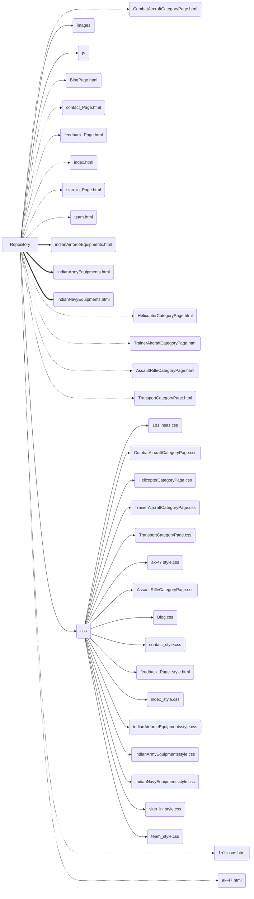

# Operation-Military-Inventory

This Project/Website was made with the aim to provide Information about all the Equipment which the Indian Armed Forces hold. For Suggestions mail me at katik2129.be21@chitkara.edu.in  .  
Click the link to visit the hoisted page : https://kartikverma0.github.io/operation-military-inventory/

File Structure:

